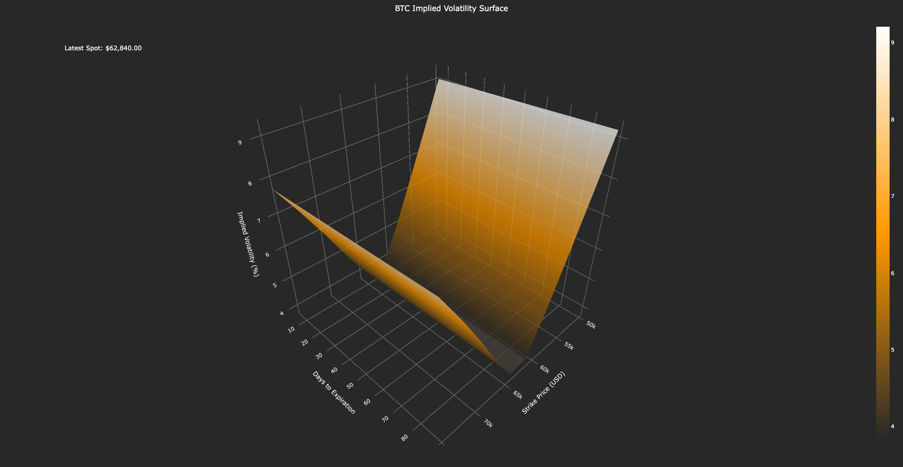

# crypto_vol_vurface

- This project simulates and visualizes implied volatility surfaces for cryptocurrency options (**BTC**, **ETH**) using the SABR model.
- It fetches historical spot data, simulates option chains, fits the SABR model, and generates 3D volatility surface plots.

---

## Files
- `crypto_vol_surface.py`: Main script for fetching data, simulating volatility, fitting the SABR model, and generating visualizations.
- No external dataset required; data is fetched live from Binance via `ccxt`.
- `btc.png`: Visualization of Bitcoin (BTC) volatility surface - Color: `#FF9900`
- `eth.png`: Visualization of Ethereum (ETH) volatility surface - Color: `#00B7EB`

---

## Libraries Used
- `numpy`
- `pandas`
- `plotly.graph_objects`
- `ccxt`
- `datetime`
- `scipy.optimize`

---

## Timeframe
- **Input**: Hourly spot data from **2024-09-01** to **2024-10-12** (configurable in code).
- **Output**: Volatility surfaces for expiration dates at **7, 14, 30, 60, and 90 days**.

---

## Features
- Fetches real-time hourly spot price data from Binance.
- Simulates an initial volatility surface with a basic smile and skew.
- Fits the SABR stochastic volatility model to the simulated surface.
- Visualizes the fitted implied volatility surface in 3D with strike prices and expiration dates.

---

## Screenshots

